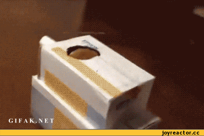

# I am Zerovirus!

**Started from hobby!**

**Currently Learning ML & AI ...**

**Wanna be: AI developer 🤖🖥️**
 
 
### Welcome to my GitHub!

 &nbsp;➡️ **Peer's code😀**

 &nbsp;➡️ **My code..🤣**
   
# My GitHub is...🤔

# 🏌️‍♂️Activities🏌️‍
|일시|활동명|내용|주최|비고|
|:---:|------|----|---|----|
|2019.11.19|2019년 2학기 세미나|P2P 대출의 수리경제학적 분석|S-Kian|[발표자료](<./files/2019 2학기 스키안 세미나 ppt.pptx>)|
|2020.05.22|2020년 1학기 세미나|연료비 연동제의 경제적 효과|S-Kian|
|2023.03.22|2023년 1학기 세미나|넷플릭스 공유 금지 정책의 영향 분석|S-Kian|[발표자료](<./files/2023 2학기 스키안 세미나 ppt.pptx>)|
|2023.05.05|경영경제대학 학술제|제로칼로리 음료 열풍에 관한 경제적 분석|중앙대학교 경영경제대학|[보고서](<./files/2023 경영경제대학 학술제 보고서 - 그저 빛날 조.pdf>)|

# 🎉Awards🎉
|일시|대회명|내용|주최|비고|
|:---:|:---:|-----|:---:|:---:|
|2023.11.16|제 12회 경제학포럼|ARIMA 및 머신러닝 기법을 활용한 역전세 조기경보모형 개발|중앙대학교 경제학부|[논문](<./files/2023 스키안 포럼 논문.pdf>) 1위|

